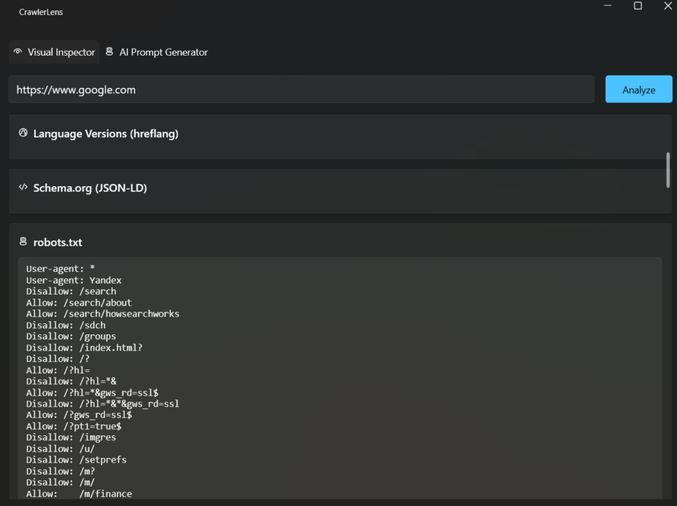
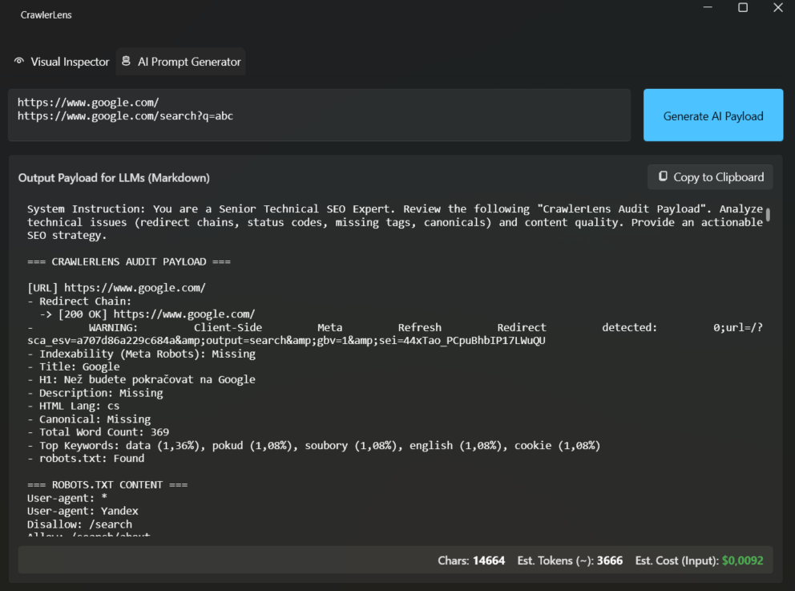

# CrawlerLens 👁️🔍

**CrawlerLens** is a modern Windows desktop application built with C# and .NET 8 that instantly analyzes how search engines and social media crawlers see a website, and generates data-rich payloads for LLM (AI) analysis.

With a beautiful Windows 11 Fluent Design interface, it offers two main workflows: a **Visual Inspector** for real-time SEO metadata debugging, and an **AI Prompt Generator** to compile deep-dive technical SEO reports for ChatGPT, Claude, or Gemini.

  
  

## ✨ Features

- **🤖 AI Prompt Generator:** Paste multiple URLs to automatically generate a structured Markdown payload for LLMs. Features redirect chain tracking (301/302/Meta Refresh status codes), token estimation, input cost calculation, and 1-click copy.
- **📄 Content Analysis:** Built-in keyword density and total word count calculator.
- **🌍 Localization & Languages:** Detect HTML language and parse `hreflang` alternate links.
- **🎯 Core SEO Metadata:** Instantly fetch Page Title, Meta Description, Meta Robots, and Canonical URLs.
- **🖼️ Social Media Cards:** Parse and visually render Open Graph (`og:*`) and Twitter (`twitter:*`) images to see exactly how links preview on social platforms.
- **🧩 JSON-LD / Schema.org:** Automatically format and display hidden structured data scripts.
- **🤖 Robots.txt parsing:** Quickly check the site's crawling rules.
- **🎨 Supermodern UX:** Built with `WPF-UI` to provide a native Windows 11 experience, complete with Mica backdrop effects, smooth animations, tabbed navigation, and a dark mode interface.

## 🛠️ Tech Stack

- **Framework:** [.NET 8.0](https://dotnet.microsoft.com/)
- **Architecture:** WPF + MVVM
- **UI Library:** [WPF-UI (lepoco)](https://github.com/lepoco/wpfui) for Fluent Design
- **HTML Parsing:** [HtmlAgilityPack](https://html-agility-pack.net/) for robust, XPath-based DOM querying
- **State Management:** `CommunityToolkit.Mvvm`

## 🚀 Getting Started

### Prerequisites

- Visual Studio 2022 (or newer)
- .NET 8.0 SDK
